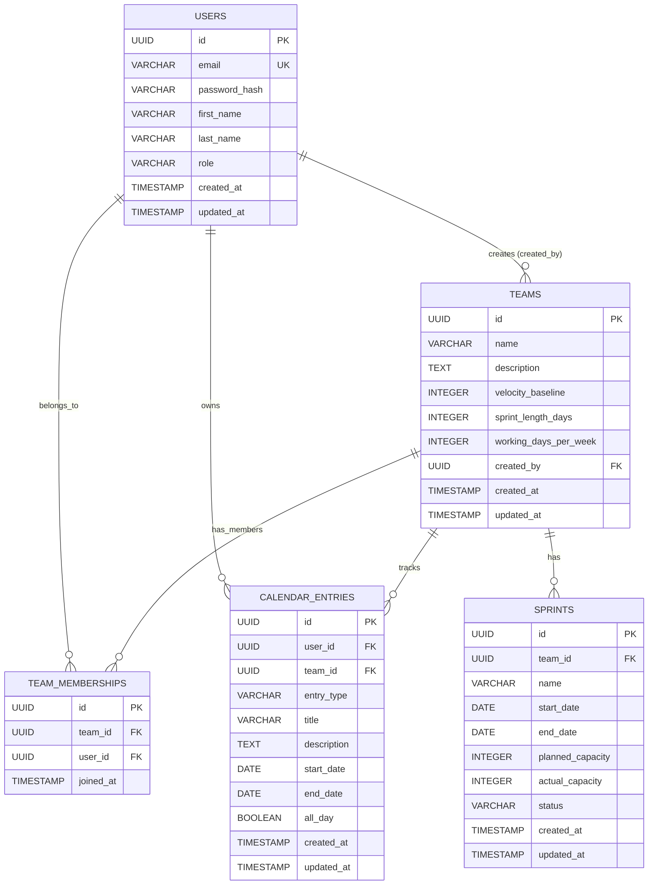

# Capacity Planner - Database Entity Relationship Diagram

## ERD Visual Representation

## Entity Relationships

### **Primary Entities**

1. **USERS** - Core user accounts (team leads and team members)
2. **TEAMS** - Development teams with capacity settings
3. **CALENDAR_ENTRIES** - PTO, holidays, and other time-off entries
4. **SPRINTS** - Sprint planning periods with capacity tracking

### **Junction Entity**

1. **TEAM_MEMBERSHIPS** - Many-to-many relationship between users and teams

## Relationship Details

### **1. Users ↔ Teams**
- **Type**: One-to-Many (via created_by)
- **Description**: A user can create multiple teams, but each team has one creator
- **Constraint**: `teams.created_by` → `users.id` (ON DELETE SET NULL)

### **2. Users ↔ Team Memberships**
- **Type**: One-to-Many
- **Description**: A user can be a member of multiple teams
- **Constraint**: `team_memberships.user_id` → `users.id` (ON DELETE CASCADE)

### **3. Teams ↔ Team Memberships**
- **Type**: One-to-Many
- **Description**: A team can have multiple members
- **Constraint**: `team_memberships.team_id` → `teams.id` (ON DELETE CASCADE)

### **4. Users ↔ Calendar Entries**
- **Type**: One-to-Many
- **Description**: A user can have multiple calendar entries (PTO, sick days, etc.)
- **Constraint**: `calendar_entries.user_id` → `users.id` (ON DELETE CASCADE)

### **5. Teams ↔ Calendar Entries**
- **Type**: One-to-Many
- **Description**: Calendar entries are associated with a specific team context
- **Constraint**: `calendar_entries.team_id` → `teams.id` (ON DELETE CASCADE)

### **6. Teams ↔ Sprints**
- **Type**: One-to-Many
- **Description**: A team can have multiple sprints over time
- **Constraint**: `sprints.team_id` → `teams.id` (ON DELETE CASCADE)

## Business Logic Constraints

### **Check Constraints**
- `users.role` ∈ ('team_lead', 'team_member')
- `calendar_entries.entry_type` ∈ ('pto', 'holiday', 'sick', 'personal')
- `calendar_entries.end_date` ≥ `start_date`
- `sprints.status` ∈ ('planned', 'active', 'completed')
- `sprints.end_date` > `start_date`

### **Unique Constraints**
- `users.email` (unique across all users)
- `team_memberships(team_id, user_id)` (prevents duplicate memberships)

## Indexes for Performance

### **Primary Indexes**
- All primary keys (id fields) have automatic indexes

### **Secondary Indexes**
- `users.email` - Fast user lookup by email
- `team_memberships.team_id` - Fast team member queries
- `team_memberships.user_id` - Fast user team queries
- `calendar_entries.user_id` - Fast user calendar queries
- `calendar_entries.team_id` - Fast team calendar queries
- `calendar_entries(start_date, end_date)` - Fast date range queries
- `sprints.team_id` - Fast team sprint queries
- `sprints(start_date, end_date)` - Fast sprint date range queries

## Data Flow for Capacity Planning

1. **Users** are assigned to **Teams** via **Team Memberships**
2. **Calendar Entries** track user availability (PTO, holidays, etc.)
3. **Sprints** are generated for teams based on their settings
4. **Capacity calculation** considers:
   - Team velocity baseline
   - Sprint duration (sprint_length_days)
   - Working days per week
   - Calendar entries reducing availability
   - Actual team member count during sprint period

This ERD supports the core capacity planning workflow by tracking team composition, individual availability, and sprint planning data.